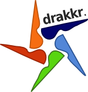

% Drakkr, la gouvernance ouverte
% 
% Version 1.0 - 19/01/2013

# Pour une gouvernance open source

Depuis plusieurs années Atos contribue à l'écosystème des logiciels libres et open source. Outre son implication technique dans de nombreux projets, Atos contribue également au niveau méthodologique. En effet, il nous semble primordial de se doter de méthodes et d'outils pour faciliter la mise en oeuvre de processus de gouvernance des logiciels open source.

Fort du succès du projet QSOS (dédié à l'industrialisation du processus de veille technologique sur les logiciels open source), Atos propose désormais un framework plus complet pour l'organisation et l'outillage d'une telle gouvernance : Drakkr.

# Pour une gouvernance ouverte

De manière à faire fonctionner le cercle vertueux de l'écosystème libre et open source, Atos a depuis 2004 pris l'habitude de contribuer à l'édification d'une gouvernance open source via la diffusion de méthodes et d'outils sous licences libres (_GNU Free Documentation License_ pour les documents et _GNU Public License_ pour les outils).

Il nous semble, non seulement naturel, mais aussi pertinent de passer par des projets libres dynamisés par l'efficacité et la capacité du travail collaboratif et communautaire pour mettre ne oeuvre une telle gouvernance. Et Drakkr s'inscrit résolument dans cette stratégie d'ouverture et de collaboration.

# Le framework Drakkr

Drakkr donc est une boite à outils concue pour aider les organisations à mettre en oeuvre une gouvernance autour des composants libres et open source, à travers des recommandations, des meilleures pratiques, des processus et des outils. 

Drakkr traite les différents processus devant être intégrés dans une gouvernance open source au sein de projets dédiés. Le tout constitue un framework complet et cohérent.

Les projets composant le framework Drakkr sont les suivants :

* __OSC__ (Open Source Cartouche) : projet dédié à l'identification unique d'une version d'un logiciel open source ainsi qu'à la gestion des ses metadonnées ;

* __ECOS__ (Evaluation des Coûts liés à l'adoption de logciels Open Source) : projet relatif à l'évaluation et au calcul du coût total de prossession d'un logiciel open source ainsi qu'au retour sur investissement d'une migration ;

* __FLOSC__ (Free/Libre Open Source Complexity) : projet proposant une méthode et un outil d'évaluation de la complexité d'un logiciel open source ;

* __QSOS__ (Qualification et Sélection de logiciels Open Source) : projet proposant une méthode et des outils pour qualifier, sélectionner et comparer les logiciels open source et ainsi industrialiser et mutualiser une démarche de veille ;

* __SLIC__ (Software LIcense Comparator) : projet dédié à la description formelle des licences open source et de leur compatibilités respectives ;

* __SecureIT__ : projet dédié à la gestion des alertes de sécurité dans les logiciels open source.

Consultez le site Web du projet Drakkr pour plus de détails : <http://www.drakkr.org>.